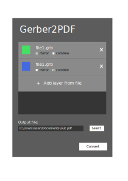

# GUI Concept Design

## Details

- The colored rectangle on the left, when clicked, will open a color chooser pop up.

## Ideas

- There should be a button / means to export the batch script.
- There should be a way to "load" a previous configuration -- maybe from a previously exported batch script?

## Questions

- How to show / control the transparency of the 

