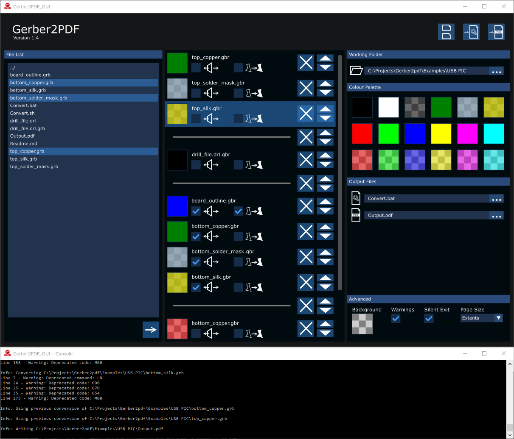
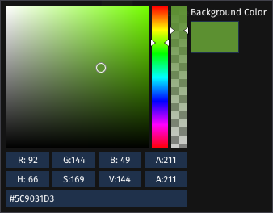

# GUI Concept Design

## Choosing a colour

The standard [Dear ImGui](https://github.com/ocornut/imgui) colour selection box is used:

## Strokes to Fills

Note that the engine applies the same setting to all instances of that Gerber file.  The GUI must therefore ensure that the check-boxes are linked across instances.

